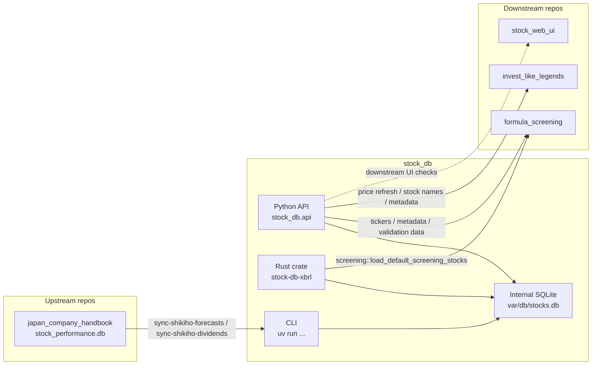
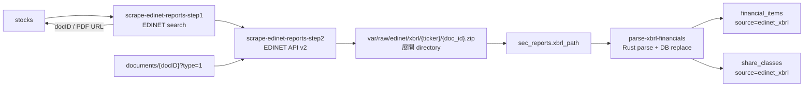
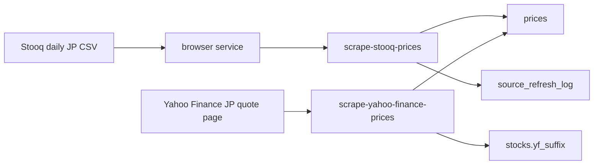
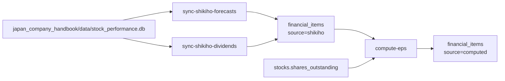

# Architecture

## 目次

- [1. 概要](#1-概要)
- [2. Repo 間依存関係](#2-repo-間依存関係)
- [3. 実行環境とセットアップ](#3-実行環境とセットアップ)
- [4. 主要コンポーネント](#4-主要コンポーネント)
- [5. データフロー](#5-データフロー)
- [6. SQLite スキーマと保存方針](#6-sqlite-スキーマと保存方針)
- [7. 公開インターフェース](#7-公開インターフェース)
- [8. 運用](#8-運用)
- [9. 開発・検証](#9-開発検証)

## 1. 概要

`stock_db` は日本株の銘柄マスタ、株価、有価証券報告書 XBRL、四季報由来の予想値を SQLite に集約するデータ基盤 repo である。

主な責務は次の通り。

- EDINET から有価証券報告書の docID を発見し、EDINET API v2 で XBRL ZIP を取得・展開する。
- Rust core で EDINET XBRL を解析し、BS / PL / CF / forecast / dividend / shares outstanding / 種類株式明細を正規化する。
- Stooq の JP 日次 CSV と Yahoo Finance JP の quote page から日次価格を保存する。
- `japan_company_handbook` の SQLite から四季報予想純利益と配当を同期する。
- 下流 repo が Python API または Rust crate の公開入口だけで同じデータを読めるようにする。`var/db/stocks.db` とテーブル構造は内部実装であり、下流の公開契約にはしない。

重要な制約として、スクレイピングは直列実行を基本とし、外部サイトへの連続アクセスには 2 秒ディレイを置く。XBRL パーサは IFRS と J-GAAP の両方を正規化対象にする。

## 2. Repo 間依存関係

`stock_db` は外部データ取得と正規化を担当し、下流 repo は `stock_db` の公開 API だけを読む。SQLite DB は `stock_db` 内部の保存手段であり、下流 repo は DB パスや内部テーブルを通常実装から参照しない。



依存の読み方:

- `japan_company_handbook` は `data/stock_performance.db` を生成し、`stock_db` の `sync-shikiho-*` CLI がこれを読む。
- `formula_screening` は `stock_db.api` と Rust crate の `screening::load_default_screening_stocks()` を使い、DB path や内部テーブルを受け取らない。
- `invest_like_legends` は `stock_db.api` から価格更新、会社名、株価 metadata を取得する。
- `stock_web_ui` の downstream UI 検証は各 consumer の公開 HTTP/API 経由で動かし、サンプル銘柄選択も `stock_db.api` を使う。
- `japan_company_handbook/data/stock_performance.db` は upstream が所有する大株主データの入力 artifact として扱う。`stock_db` issue 16 の DB 境界は `stock_db/var/db/stocks.db` とその内部テーブルを対象にし、handbook DB の直接読み取り禁止は別スコープにする。

関連 repo の bookmark は Rust 移行後の現行実装を `main`、旧 Python 系を `py` として扱う。`push-*` は `jj git push --change` 由来の一時 bookmark であり、長期運用名にはしない。

## 3. 実行環境とセットアップ

必要な実行環境:

- Python 3.11 以上
- Rust stable toolchain
- Node.js。CI では Node.js 24 を使う。
- `uv`

初回セットアップ:

```bash
uv sync --frozen
npm ci --prefix services/browser
```

EDINET API を使う処理では `EDINET_API_KEY` が必要である。環境変数のほか、repo root の `.env` も参照する。

```bash
export EDINET_API_KEY=...
```

既存 DB は `var/db/stocks.db` に配置する。`uv run inspect-stock-db 7203 --limit 1` で読み取り確認する。

## 4. 主要コンポーネント

### 4.1 Python package

`src/stock_db/` は CLI、外部 source client、storage layer、browser service client を持つ。

- `paths.py`: repo root、`var/`、設定ファイル、既定 DB パスを定義する。
- `storage/`: SQLite 接続、schema 初期化、各テーブルの CRUD を提供する。
- `sources/edinet/`: EDINET API、検索フォーム scraping、XBRL parser wrapper を持つ。
- `sources/stooq/`: Stooq 日次 CSV と履歴バンドルの download / parse / ingest / command wrapper を持つ。
- `sources/yahoo_finance_jp/`: Yahoo Finance JP HTML の parse / scrape / DB 保存を持つ。
- `browser_client/`: Node.js browser service を subprocess で起動し HTTP API を呼ぶ。
- `cli/`: repo の運用入口を `pyproject.toml` の project scripts として公開する。

### 4.2 Rust core

`rust/` は `stock-db-xbrl` crate であり、PyO3 extension `stock_db._edinet_xbrl` と Rust library の両方を提供する。

- XBRL artifact をロードし、通常 `.xbrl` は 1 回の XML 走査で context / unit / namespace / fact を抽出する。
- EDINET XBRL の BS / PL / CF / forecast / dividend / shares outstanding / 種類株式を正規化する。CF では自己株式取得額を `cf.treasury_stock_purchase` として保持し、下流の総還元性向計算に使う。
- ticker 単位の XBRL parse と DB 置換書き込みを Rust 側で実行する。
- Stooq 日次 CSV parse を Rust 側で実行し、Python 側は DB upsert に集中する。
- `screening` module は下流 Rust 実装向けに `stocks.db` から screening 用データを読む。

重い処理は PyO3 で GIL を解放し、ticker や文書単位の並列化は Rayon に寄せる。SQLite 書き込みは競合を避けるため逐次実行する。

### 4.3 Browser service

`services/browser/` は Node.js / Express / Puppeteer 系の browser service である。Python から起動され、Stooq や EDINET 検索など通常の HTTP client だけでは扱いにくいページ取得を担当する。

主な endpoint:

- `/fetch`: URL にアクセスして HTML を返す。
- `/download`: browser 経由でファイルを download する。
- `/evaluate`: ページ上で JavaScript を評価する。
- `/stooq/*`: Stooq 日次 CSV と履歴バンドル取得用の専用 endpoint。
- `/shutdown`: service を終了する。

### 4.4 設定ファイル

`config/` は実行時の定数と CLI 既定値を持つ。

- `cli_defaults.toml`: CLI の既定引数。
- `magic_numbers.toml`: timeout、retry、wait interval など。
- `edinet_phase1.toml`: EDINET Phase 1 の alias / excluded ticker。
- `jpx_market_holidays.toml`: JPX 市場休日。未定義年は例外で止め、土日判定だけには fallback しない。

## 5. データフロー

### 5.1 EDINET



Phase 1 は検索フォームから有価証券報告書 docID を見つける。提出者名は `stocks.name`、`config/edinet_phase1.toml` の alias、Yahoo Finance JP の quote title を正規化して候補化する。ETF など自己名義の有報 URL を持たない対象は `excluded_tickers` で除外する。

Phase 2 は EDINET API v2 で ZIP を取得し、ZIP 原本と展開済み artifact を保存する。`sec_reports.xbrl_path` には展開済み artifact root を保存し、parse 時は `sec_reports` から対象 artifact を読む。

`scrape-edinet-historical` は EDINET API v2 の書類一覧 API から過去提出分を探索し、`secCode` の先頭 4 桁で DB 内 ticker と照合する。discovery と processing は checkpoint で再開可能にする。

### 5.2 Prices



Stooq は JP 全銘柄の日次 CSV を取り込み、`prices.close` を upsert する。価格更新が必要かどうかは前営業日の JPX 終値が全 DB 銘柄に揃っているかで判定し、Stooq 側の成功した更新チェック時刻は `source_refresh_log` に保存する。Stooq の配布ファイルが最新でも `.JP` 行だけ前営業日に追いついていない場合は、短い間隔で Stooq を再試行し、Yahoo Finance JP の全銘柄補完には進まない。`stock_db` 外の repo から Python の価格読み取り API または Rust screening API が呼ばれた場合は、この鮮度確認を API 側で行い、古ければ `refresh-prices --if-needed` 経由で自動更新する。

Yahoo Finance JP は Stooq が目標営業日に到達した後でも埋まらない非東証 stale 銘柄の前日終値を補完する。自動価格更新では `stocks.yf_suffix` が `.N`、`.S`、`.F` と分かっている銘柄だけを対象にし、`.T` の東証銘柄と suffix 未判定銘柄は Yahoo で探索・取得しない。接尾辞は EDINET 補助などで検出した値を `stocks.yf_suffix` に保存して次回以降の探索を省く。Yahoo 補完は 1 銘柄ずつ実行し、個別銘柄の未取得・古い quote・接尾辞未解決は `PriceRefreshResult` の `yahoo_errors` / `unresolved_tickers` に集約する。個別銘柄の失敗では価格更新全体を停止せず、最後まで試行してから結果を返す。

### 5.3 Shikiho and derived data



四季報予想は upstream に残る全履歴から最新2期を選び、古い方を `forecast.net_income_current`、新しい方を `forecast.net_income_next` として保存する。配当は `dividend.dps` として保存する。同期時は upstream から消えた `shikiho` 行も削除してから再生成する。`compute-eps` は過去 EPS と予想 EPS を `source=computed` で生成する。

## 6. SQLite スキーマと保存方針

主要テーブル:

| テーブル | 役割 |
|---|---|
| `stocks` | ticker、会社名、EDINET / Yahoo 補助メタデータ、発行済株式数 |
| `sec_reports` | 有報 docID、fiscal year、XBRL artifact path |
| `financial_items` | 財務値。EDINET、四季報、計算値を `statement / item / source` 単位で保持 |
| `share_classes` | 種類株式別の発行済株式数 |
| `prices` | 日次価格。Yahoo 由来行では volume を保持し得る |
| `source_refresh_log` | Stooq 更新チェック時刻と価格更新試行時刻 |

保存方針:

- SQLite 接続は WAL と foreign key を有効にする。
- SQLite schema は `stock_db` 内部実装である。下流 repo は `stocks`、`prices`、`financial_items` などの内部テーブルを直接読まず、公開 API の戻り値 contract に依存する。
- `financial_items` の正本は EDINET XBRL の `source=edinet_xbrl` とする。`cf.treasury_stock_purchase` は `jppfs_cor:PurchaseOfTreasuryStockFinCF` を canonical item として取り込む。
- `bs.non_current_liabilities` が XBRL に明示されず、`total_assets - total_equity - current_liabilities` が 0 以上に一意決定できる場合は、その値を canonical item として導出する。
- 四季報由来の予想純利益と配当は `source=shikiho` とする。
- EPS など派生値は `source=computed` とする。
- `financial_items` の主キーには `source` を含め、同一 item の source 別共存を許す。
- `parse-xbrl-financials` は ticker 単位で旧 EDINET / IRBank 系 source を置換し、同一 ticker の最新 parse 結果に揃える。
- raw EDINET artifact は `var/raw/edinet/xbrl/{ticker}/{doc_id}.zip` と sibling の展開 directory を正規入力とする。

## 7. 公開インターフェース

### 7.1 CLI

EDINET:

```bash
uv run scrape-edinet-reports
uv run scrape-edinet-reports-step1
uv run scrape-edinet-reports-step2
uv run scrape-edinet-historical
uv run parse-xbrl-financials
uv run parse-xbrl-bs
uv run report-edinet-progress
uv run purge-irbank-financials
```

Prices:

```bash
uv run refresh-prices
uv run scrape-stooq-prices
uv run scrape-yahoo-finance-prices
uv run scheduled-refresh-prices --headless
```

External sync and derived data:

```bash
uv run sync-shikiho-forecasts
uv run sync-shikiho-dividends
uv run compute-eps
```

Inspection:

```bash
uv run inspect-stock-db 7203 --limit 1
uv run generate-validation-site-list
```

### 7.2 Python API

下流 repo が使う代表的な API:

- `stock_db.api.ensure_prices_fresh()`
- `stock_db.api.PriceRefreshCommandResult`
- `stock_db.api.PriceRefreshError`
- `stock_db.api.get_all_tickers()`
- `stock_db.api.get_stock_names()`
- `stock_db.api.get_screening_tickers(limit=None)`
- `stock_db.api.load_screening_stocks(tickers=None, fcf_periods=10, pl_periods=6)`
- `stock_db.api.get_stock_price_metadata()`
- `stock_db.api.get_validation_targets(limit)`
- `stock_db.api.get_latest_balance_sheet(ticker, source="edinet_xbrl")`

`stock_db` 外の repo から価格を読む API を呼ぶ場合、API は前営業日終値が全 DB 銘柄に揃っているかを確認し、必要なら `stock_db` repo root から `uv run refresh-prices --if-needed` を実行する。更新は Stooq を先に試し、まだ stale な銘柄を Yahoo Finance JP で直列・2秒ベースのディレイで補完する。個別銘柄の取得失敗や補完後に残った stale 銘柄は結果 summary に出すが、価格更新コマンド自体は最後まで完走する。完走後は価格更新試行時刻を `source_refresh_log` に記録し、同日内の API 呼び出しで同じ大量スクレイピングを繰り返さない。DB 接続失敗や subprocess 起動失敗などの基盤エラーは例外にする。

`load_screening_stocks()` は銘柄名、最新終値、終値日、発行済株式数、最新財務値、CF/PL 履歴を返す。下流 UI は `get_stock_price_metadata()` の `price_date` と `target_price_date` を比較し、古い株価・未取得株価を通常銘柄より目立ちにくく表示できる。

### 7.3 Rust API

`stock-db-xbrl` は PyO3 extension と Rust crate として使われる。

PyO3 module `stock_db._edinet_xbrl` の代表 API:

- `parse_xbrl_artifact(path)`
- `parse_financials(path)`
- `parse_share_classes(path)`
- `parse_inventories(path)`
- `parse_xbrl_financials_to_db(db_path, ticker=None, from_ticker=None, skip_existing=True, emit_progress=False)`
- `parse_stooq_daily_file(path)`
- `is_valid_xbrl_text(content)`
- `is_valid_xbrl_path(path)`

Rust crate 側では `screening::load_default_screening_stocks(tickers, fcf_periods, pl_periods)` を下流の Rust screening 実装が使う。この入口は `STOCK_DB_VAR_DIR` から内部 DB を解決し、DB path を公開 contract にしない。DB path を受け取る読み取り関数は crate 外へ公開しない。`stock_db` 外の cwd から呼ばれた場合は、DB 読み取り前に `refresh-prices --if-needed` で汎用価格更新を確認する。返却する `ScreeningStock` には株価基準日の `price_date` を含める。

## 8. 運用

手動で価格を更新する場合:

```bash
uv run refresh-prices --headless
```

Stooq を先に取り込み、残った stale 銘柄を Yahoo Finance JP で補完する。Stooq 更新だけを確認したい場合は `uv run scrape-stooq-prices --headless` を使う。

```bash
uv run purge-irbank-financials
```

で artifact から IRBank 系 source を除去する。

DB を確認する場合:

```bash
uv run inspect-stock-db 7203 --limit 1
```

EDINET の進捗確認は `uv run report-edinet-progress` を使う。Phase 1 の actionable pending と excluded ticker は別々に見る。

### Local scheduled price refresh

`scheduled-refresh-prices` は JST 16:00 以降かつ JPX 営業日にのみ当日分の終値を取得する。user systemd timer が `Mon..Fri *-*-* 16:00:00 Asia/Tokyo` で起動し、CLI 側で JPX 営業日判定を行う。timer の unit file は `services/systemd/user/` にあり、home-manager に統合して使用する。ログアウト中も timer を動かすため `loginctl enable-linger` を有効にする。

### Downstream JSON refresh

価格更新完了後の 16:05 JST に、下流 3 プロジェクトで公開用 JSON を再生成する。`services/downstream_refresh.py` が次の順に各プロジェクトのコマンドを実行する。

1. `formula_screening`: `python -m formula_screening screen -s strategies/net_cash_fcf.toml -t all --json docs/assets/screening.json`
2. `land_value_research`: `python -m src.web --export-github-pages`
3. `invest_like_legends`: `python scripts/enrich_investors.py`

各プロジェクトは JSON 生成後に `_auto_push_json()` で jj commit + jj git push を行う。各ステップは独立しており、個別の失敗で後続を止めない。user systemd timer `stock-db-downstream-refresh.timer` が `Mon..Fri *-*-* 16:05:00 Asia/Tokyo` で起動し、`stock-db-price-refresh.service` の後に実行される。

## 9. 開発・検証

通常の検証:

```bash
uv run pytest
cargo test
npm test --prefix services/browser
```

ドキュメント変更後の最低限の確認:

```bash
rg -n "^## [0-9]+\\." ARCHITECTURE.md
rg -n "```mermaid|japan_company_handbook|formula_screening|invest_like_legends|stock_web_ui" ARCHITECTURE.md
uv run inspect-stock-db 7203 --limit 1
```

注意点:

- ブランチは追加しない。
- 作業コピーに既存の未確定変更がある場合、それを戻さず、対象変更だけを重ねる。
- スクレイピング系の実行では直列処理と 2 秒ディレイを守る。
- XBRL 解析の変更では IFRS と J-GAAP の両方を壊していないことを確認する。
- XBRL の canonical financial item 候補タグは `rust/src/financials.rs` の unit test に `main` 由来の静的スナップショットを持つ。実行時に `main` を読まず、現在実装が最低条件として包含していることを検証する。
- `rust/src/screening.rs` の unit test は、source ごとの forecast / dividend 統合と履歴期間の組み立てを直接固定する。
